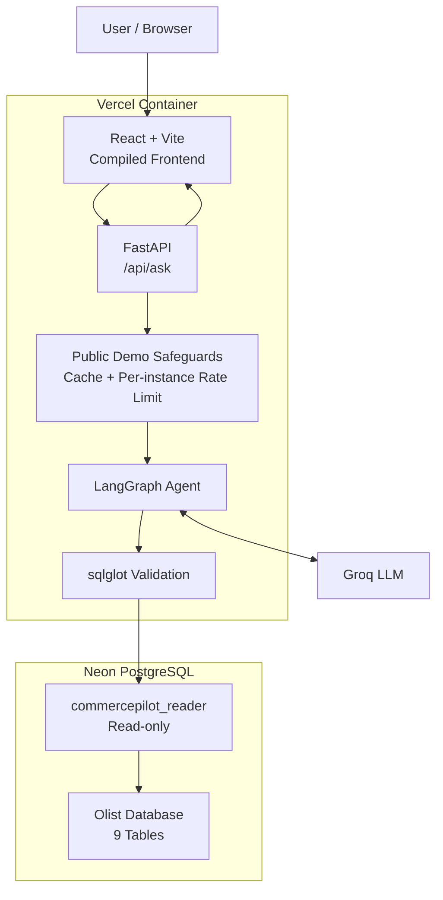

# CommercePilot

[](https://github.com/nancyyrashed/commerce-pilot/actions/workflows/ci.yml)

[Live Demo](https://commerce-pilot-rho.vercel.app/) · [Architecture](docs/architecture.md)

CommercePilot is a natural-language-to-SQL analytics agent for the Brazilian E-Commerce Public Dataset by Olist. It turns business questions into validated PostgreSQL queries, executes them through a restricted read-only database role, repairs failed SQL when needed, and returns grounded answers with the generated SQL and execution details.

The project is designed as a production-style AI engineering portfolio project rather than a notebook-only demo: it includes a LangGraph agent workflow, deterministic SQL guardrails, automated evaluation, FastAPI + React, Docker, CI, a full Neon PostgreSQL deployment, and a public Vercel demo.

## Highlights

- Natural-language business questions → PostgreSQL SQL
- Structured request routing: answerable, clarification-needed, unanswerable, or rejected
- Combined request classification + initial SQL generation
- Deterministic SQL validation with `sqlglot`
- Restricted `commercepilot_reader` production role
- Maximum 100-row result cap
- 10-second PostgreSQL statement timeout
- Bounded SQL repair loop with up to 3 generation attempts
- Cached schema context and scalar-result fast path for lower latency
- Successful-answer cache for repeated public-demo questions
- Lightweight per-instance request limiting for the public demo
- React frontend served directly by FastAPI
- Dockerized local and production-style runtime
- GitHub Actions CI
- Full Olist PostgreSQL dataset deployed on Neon
- Public application deployed on Vercel

## Live demo

**https://commerce-pilot-rho.vercel.app/**

Example questions:

```text
How many orders are in the dataset?

What percentage of customers made more than one purchase?

Which product categories generated the highest delivered sales value?

How did monthly order volume change over time?
```

CommercePilot returns:

- a natural-language answer
- executed SQL
- tables used
- SQL-generation attempt count
- returned-row count
- success/failure status
- request duration

## Architecture



Detailed production and query-safety diagrams are available in [docs/architecture.md](docs/architecture.md).

## Agent workflow

```text
User question
    ↓
cached schema inspection
    ↓
classification + initial SQL generation
    ↓
answerable?
    ├── no  → clarify / unanswerable / reject
    │
    └── yes
         ↓
    sqlglot validation
         ↓
    safe SQL execution
         ↓
    success?
    ├── yes → answer
    │
    └── no
         ↓
    attempts < 3?
         ├── yes → repair SQL → validate → execute
         └── no  → safe failure response
```

For one-row, one-column results, CommercePilot uses deterministic formatting instead of a second LLM call. More complex result sets use a grounded final-answer generation step.

## SQL safety

Model-generated SQL is never executed directly without validation.

The application enforces:

- single-statement queries
- read-only query patterns
- no `INSERT`, `UPDATE`, `DELETE`, `DROP`, or other destructive statements
- no `SELECT INTO`
- no data-changing operations hidden inside CTEs
- no locking queries such as `FOR UPDATE`
- maximum 100 returned rows
- restricted PostgreSQL execution through `commercepilot_reader`
- 10-second PostgreSQL statement timeout
- maximum 3 SQL-generation attempts

The database permission boundary remains independent of the application validator: the production role itself cannot modify the database.

## Evaluation

CommercePilot includes a hand-checked 60-question benchmark:

| Category | Questions |
| --- | ---: |
| Simple | 20 |
| Joins & aggregations | 15 |
| Multi-step | 10 |
| Ambiguous | 5 |
| Unanswerable | 5 |
| Adversarial | 5 |
| **Total** | **60** |

The 45 answerable questions have hand-written reference SQL and are evaluated primarily by execution behavior and result equivalence rather than exact SQL-string matching.

Final production regression:

```text
Answerable cases:       45/45 passed
Non-answerable cases:   15/15 passed
------------------------------------
Full production suite:  60/60 passed

Failures:                0
Infrastructure errors:   0
```

These are **post-refinement regression results**, not untouched held-out accuracy. Earlier failures were used to improve the evaluator and strengthen general SQL-generation rules, so the 60/60 result demonstrates that the refined agent passes the complete project regression suite rather than claiming perfect accuracy on arbitrary unseen questions.

Evaluation files:

- `evaluation/eval_questions.json`
- `evaluation/reference_queries.json`
- `evaluation/production_regression_final.json`

## Automated testing and CI

Current Python test result:

```text
51 passed
```

Coverage includes:

- SQL validation and guardrails
- database inspection and safe query execution
- LangGraph routing and repair behavior
- FastAPI responses and error handling
- provider and public-demo rate-limit handling
- answer caching
- evaluation-result comparison

Frontend checks:

```cmd
npm --prefix frontend run lint
npm --prefix frontend run build
```

GitHub Actions runs on pushes and pull requests to `main` and performs:

```text
Python dependency install
    ↓
temporary PostgreSQL 17 service
    ↓
schema + synthetic CI seed
    ↓
python -m pytest
    ↓
frontend dependency install
    ↓
frontend lint
    ↓
frontend production build
    ↓
Docker image build
```

The CI database uses a small synthetic fixture and recreates the restricted `commercepilot_reader` role, so integration tests exercise the same read-only boundary expected by the application.

## Tech stack

**AI / agent**

- Groq
- LangChain
- LangGraph
- Pydantic

**Backend / data**

- Python 3.11
- FastAPI
- PostgreSQL 17
- Psycopg
- `sqlglot`

**Frontend**

- React
- Vite
- `react-markdown`

**Infrastructure**

- Docker
- Docker Compose
- GitHub Actions
- Neon PostgreSQL
- Vercel container deployment

## Dataset

CommercePilot uses the **Brazilian E-Commerce Public Dataset by Olist**.

The project loads 9 source datasets into PostgreSQL:

- customers
- geolocation
- order items
- order payments
- order reviews
- orders
- products
- sellers
- product category translations

The full local database is approximately 195 MB after removing exact duplicate geolocation rows.

Important analytical semantics used by the agent include:

- `customer_unique_id` represents the real customer identity across orders
- sales value is based on `SUM(order_items.price)` and excludes freight
- sales-value questions default to delivered orders when status is not specified
- one-to-many joins must preserve the intended analytical grain
- product-category names use the English translation when available
- the dataset is historical and covers approximately 2016–2018

See:

- [Dataset Setup](docs/data_setup.md)
- [Data Dictionary](docs/data_dictionary.md)

## Local setup

Requirements:

- Python 3.11
- Node.js 18+
- Docker Desktop

Clone the repository and create the environment:

```cmd
python -m venv .venv
.venv\Scripts\activate
python -m pip install -r requirements.txt
npm --prefix frontend install
```

Copy `.env.example` to `.env` and fill in your private values.

Start PostgreSQL:

```cmd
docker compose up -d
```

Run the API:

```cmd
python -m uvicorn src.api:app --host 127.0.0.1 --port 8000
```

Run the React development server in another terminal:

```cmd
npm --prefix frontend run dev
```

Run the Python test suite:

```cmd
python -m pytest
```

## Production deployment

The public deployment uses:

```text
GitHub
   ↓
Vercel container
   ├── compiled React frontend
   └── FastAPI
          ↓
       LangGraph
       ↙     ↘
    Groq    Neon PostgreSQL
```

Production database access uses a pooled Neon connection string for the restricted `commercepilot_reader` role.

Production credentials are supplied only through environment variables and are never committed to Git.

The public-demo answer cache and request limiter are process-local. On Vercel, separate container instances may maintain independent in-memory state, so the limiter is intentionally treated as a lightweight per-instance safeguard rather than a globally distributed rate limiter.

## Repository structure

```text
commerce-pilot/
├── .github/workflows/      # GitHub Actions CI
├── data/                   # local dataset location
├── docs/                   # architecture and dataset documentation
├── evaluation/             # benchmark, references, evaluators, results
├── frontend/               # React + Vite frontend
├── scripts/                # schema, loading, CI seed, DB utilities
├── src/                    # FastAPI, LangGraph agent, SQL safety
├── tests/                  # automated Python tests
├── Dockerfile              # local/general production image
├── Dockerfile.vercel       # Vercel container deployment
├── compose.yaml            # local app + PostgreSQL stack
├── requirements.txt
└── README.md
```

## Key project files

- `src/agent_graph.py` — LangGraph workflow and retry routing
- `src/agent_nodes.py` — planning, SQL generation/repair, execution, answer nodes
- `src/prompts.py` — classification, planning, SQL, and answer prompts
- `src/sql_validator.py` — deterministic SQL safety validation
- `src/database_tools.py` — PostgreSQL inspection and query execution
- `src/api.py` — FastAPI routes and production frontend serving
- `src/public_demo.py` — answer cache and lightweight request limiter
- `evaluation/evaluate_production_agent.py` — production-path regression evaluator
- `docs/architecture.md` — detailed architecture diagrams

## Security and credentials

The repository should never contain:

- `.env`
- PostgreSQL passwords
- Groq API keys
- Neon database URLs
- raw Olist CSV files

Safe examples and placeholders are kept in `.env.example`.

## License and attribution

Dataset:

**Brazilian E-Commerce Public Dataset by Olist**

Kaggle identifier:

```text
olistbr/brazilian-ecommerce
```

The dataset page reports **CC BY-NC-SA 4.0**.

CommercePilot is a non-commercial personal portfolio project. Dataset attribution and license information remain visible in the repository and documentation.

The dataset license does not automatically define the license of CommercePilot's source code.

## Status

**Phase 0–7 complete.**

- Local PostgreSQL development environment complete
- Full dataset pipeline complete
- SQL tools and guardrails complete
- LangGraph agent complete
- Evaluation complete
- FastAPI + React application complete
- Docker and CI complete
- Neon + Vercel production deployment complete
- Public-demo safeguards complete
- Production architecture documentation complete

**Live demo:** https://commerce-pilot-rho.vercel.app/
