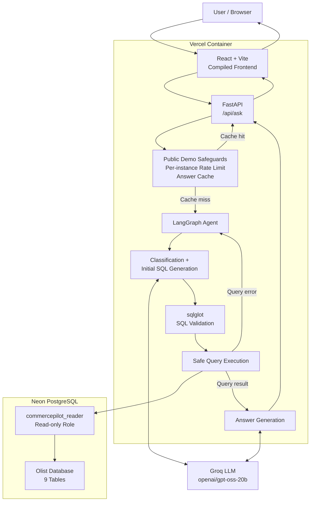
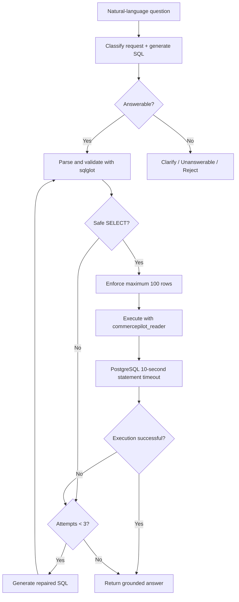

# CommercePilot Architecture

CommercePilot uses PostgreSQL throughout local development, testing, and production. The public demo runs as a single containerized application on Vercel, while the production database is hosted on Neon.

## Production architecture

## Query execution safeguards

## Production boundaries

The deployed application uses several independent safety layers:

- model-generated SQL is parsed and validated before execution
- only read-only query patterns are accepted
- result sets are capped at 100 rows
- PostgreSQL access uses the restricted `commercepilot_reader` role
- the reader role has a 10-second PostgreSQL statement timeout
- SQL repair is limited to a maximum of 3 generation attempts
- successful repeated questions can be served from an in-memory answer cache
- a lightweight per-instance request limiter protects the public portfolio demo
- secrets are provided through environment variables and are not committed to Git

The public-demo cache and request limiter are process-local. On a platform such as Vercel, multiple container instances may maintain independent in-memory state, so the limiter is intentionally described as a lightweight per-instance safeguard rather than a globally distributed rate limit.